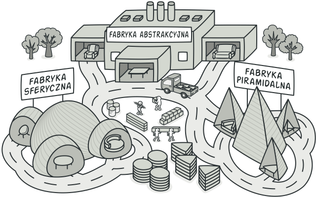

## Abstract Factory

+ Fabryka rodziny obiektów
+ Pozwala upewnić się, że obiekty będą ze sobą dobrze współdziałać
+ Upraszcza kod wstecznej kompatybilności (np wersje w API)
+ Niewidoczna dla klienta zmiana implementacji

