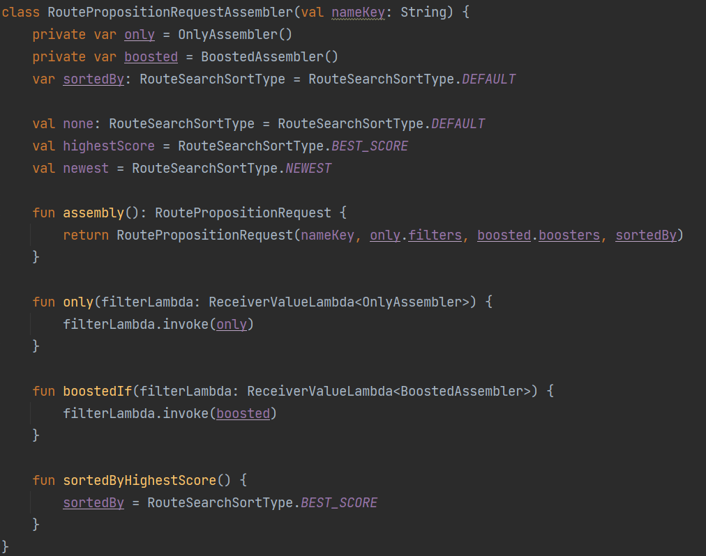
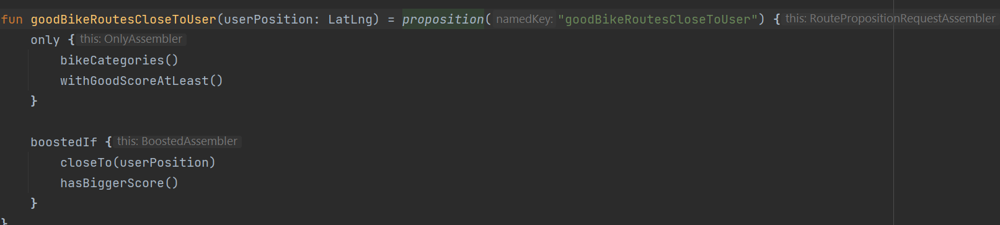

## Builder (Assembler)

+ Tworzenie skomplikowanych obiektów
+ Czytelne rozróżnienie opcjonalnych i wymaganych parametrów
+ Zapewniona niemutowalność końcowego obiektu
+ Dodatkowa opcja stworzenia Domain Specific Language dla większej czytelności i reużywalności

### Czy w Kotlinie w ogóle potrzebujemy Assemblera?

#### Przykład z życia - Traseo

Assembler

DSL

